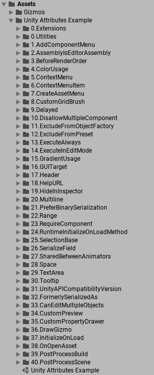
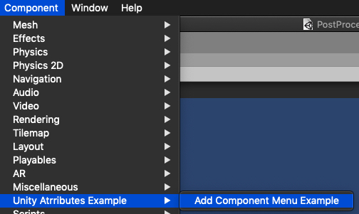

# Unity-Attributes-Example

 Unity attribute 例子整理

1. [AddComponentMenu](Assets/Unity Attributes Example/1.AddComponentMenu/AddComponentMenuExample.cs) （添加组件菜单）

 
2. [AssemblyIsEditorAssembly](Assets/Unity Attributes Example/2.AssemblyIsEditorAssembly/AssemblyIsEditorAssemblyExample.cs) （引擎会把该程序集下的全部类视为编辑器类）

3. [BeforeRenderOrder](Assets/Unity Attributes Example/3.BeforeRenderOrder/BeforeRenderOrderExample.cs) （设置Application.onBeforeRender回调函数的执行顺序）

4. [ColorUsage](Assets/Unity Attributes Example/4.ColorUsage/ColorUsageExample.cs) （拾色器界面）

5. [ContextMenu](Assets/Unity Attributes Example/5.ContextMenu/ContextMenuExample.cs) (为组件添加快捷菜单)

6. [ContextMenuItem](Assets/Unity Attributes Example/6.ContextMenuItem/ContextMenuItemExample.cs)  （为脚本属性添加快捷菜单）

7. CreateAssetMenu - 添加ScriptableObject的创建菜单（Project面板->右键->Create->你的菜单）

8. CustomGridBrush

9. Delayed

10. DisallowMultipleComponent

11. ExcludeFromObjectFactory

12. ExcludeFromPreset

13. ExecuteAlways

14. ExecuteInEditMode

15. GradientUsage

16. GUITarget

17. Header

18. HelpURL

19. HideInInspector

20. Multiline

21. PreferBinarySerialization

22. Range

23. RequireComponent

24. RuntimeInitializeOnLoadMethod - 回调函数（程序启动时）

25. SelectionBase

26. SerializeField

27. SharedBetweenAnimators

28. Space

29. TextArea

30. Tooltip - 提示（Inspector面板->鼠标停留在脚本的属性上）

31. UnityAPICompatibilityVersion

32. FormerlySerializedAs

33. CanEditMultipleObjects

34. CustomPreview

35. CustomPropertyDrawer

36. DrawGizmo

37. InitializeOnLoad - 该类在Unity引擎打开时会被创建

	1. InitializeOnLoadMethod - 回调函数（打开Unity引擎后）

38. OnOpenAsset - 打开资源时（Asset面板->双击选中的文件)

39. PostProcessBuild - 回调函数（每次发布程序后）

40. PostProcessScene - 回调函数（每次进入场景前）

41. [GridPaintSorting](Assets/Unity\ Attributes\ Example/41.GridPaintSorting/README.md)

42. MenuItem

43. SettingsProvider 
